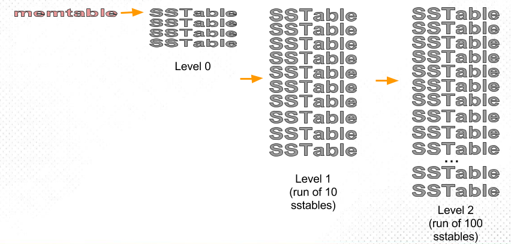
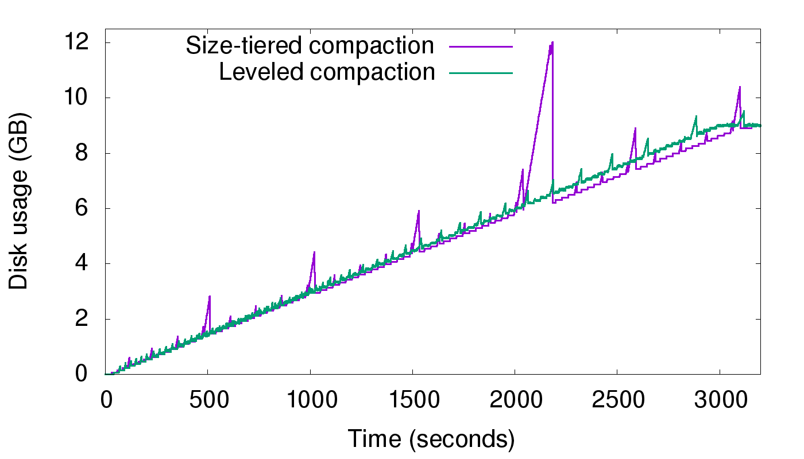
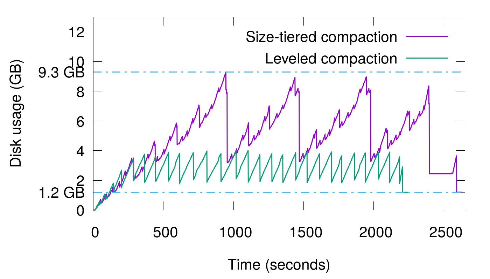
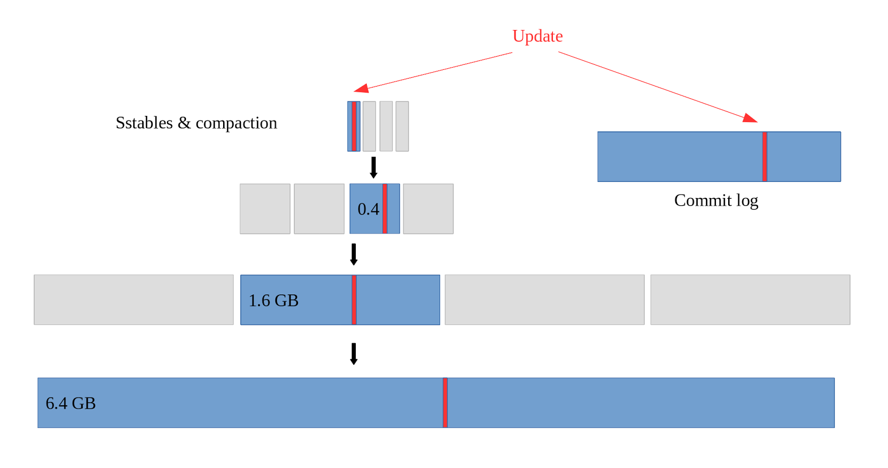

# Compaction 策略 - Leveled

在上一章，我们介绍了 **Size-Tiered Compaction 策略（STCS）**，讨论了 STCS 的原理，并着重分析了它的缺陷 – **空间放大**。本章我们将会介绍另一种策略 – **Level Compaction Strategy (LCS)**，该策略能够显著降低 STCS 带来的空间放大，同时也能改善**读放大**带来的性能损失，但它也会带来其他负面的效果 – **写放大**。本章我们将围绕空间放大、写放大、读放大，三个维度来展开分析 LCS。

### Leveled Compaction Strategy

与 STCS 对比，LCS 具备如下特点：

- sst 的大小可控，默认每个 sst 的大小一致（STCS 在经过多次合并后，层级越深，产生的 sst 文件就越大，最终会形成超大文件）
- LCS 在合并时，会保证除 Level 0（L0）之外的其他 Level 有序且无覆盖
- 除 L0 外，每层文件的总大小呈指数增长，假如 L1 最多 10 个，则 L2 为 100 个，L3 为 1000 个…

我们来看下 LCS 具体是如何工作的，如下图：

首先是内存中的 memtable 刷到 L0，当 L0 中的文件数达到一定阈值后，会将 L0 的所有文件及与 L1 有覆盖的文件做合并，然后生成新文件（如果文件大小超过阈值，会切成多个）到 L1，L1 中的文件时全局有序的，不会重现重叠的情况；

当 L1 的文件数量达到阈值时，会选取 L1 中的一个 sst 与 L2 中的多个文件做合并，假设 L1 有 10 个文件，那么一个文件便占 L1 数据量的 1/10，假设每层包含的 key 范围相同，那么 L1 中的一个文件理论上会覆盖 L2 层的 10 个文件，因此会选取 L1 中的一个文件与 L2 中的 10 个文件一起 compaction，将生成的新文件放到 L2；

当 L2 文件数量达到阈值时，处理方式同上，如此往复。

### 空间放大

介绍完 LCS 的工作原理后，我们来看下 LCS 是如何解决空间放大的。在上一章中，我们看到空间放大主要由两个原因：1. compaction 过程中，会产生临时空间占用；2. 重复数据分散在不同的 sst 中，导致空间浪费。

LCS 不会像 STCS 一样产生明显的临时磁盘占用问题。由于 STCS 存在超大 sst 的情况，因此在将这些超大 sst 合并时，会产生更大的文件，这些文件会临时同时存放在磁盘上，导致临时空间放大严重。LCS 不会有超大文件，而且在层与层之间合并时，大体上只选取 11 个 sst 进行 compaction，而这 11 个文件的大小只占整个系统的小部分，因此临时空间放大很小。

LCS 也不会像 STCS 那样，被重复数据所困扰，原因是 LCS 中除 L0 之外，其他层的数据都是有序不重叠的，因此每层内，各个 sst 间不存在重复数据。下面举例验证下 LCS 确实具备较低的空间放大。

LCS 最好的情况是，最后一层数据已经被填满。假设最后一层为 L3，一共有 1000 个 sst。那么 L1 和 L2 一共最多 110 个文件。由于每个 sst 基本大小相同，因此，几乎 90% 的数据在 L3。我们直到每层内的数据不会重复，因此最多，L1 和 L2 的数据包含在 L3 中，重复数据导致的空间放大为 1/0.9=1.11，相比上一章 STCS 8 倍的空间放大好得多。

然后，也存在比较差的情况，即当最后一层没有填满时，假设 L3 的文件个数为 100 个，L2 中的文件数也是 100 个，最坏情况下，如果 L2 和 L3 的数据相同，则会产生 2 倍的空间放大。但即使是这样，相对 STCS 还是好得多。

为了能够更直观的对比 LCS 和 STCS，Scylla 官方对 LCS 做和上一章同样的实验。我们来看看实验结果。

#### 实验 1

实验 1 是持续写入不同的数据，如上图，可以看到，随着数的不断写入，STCS 会出现较大的毛刺，在最大一次 compaction 时，毛刺达到最巅峰，空间放大达到了 2。而 LCS 的毛刺比较小，空间放大很小，和上面的推导一致。

#### 实验 2

实验 2 是一种极端情况，不断写入重复数据，且重复的粒度是 1.2 GB，即所有 sst 中的数据相同。如上图，可以看到 STCS 的空间放大接近 8 倍。而 LCS 的空间放大也超过了 2，原因是这里数据量不能使 LCS 产生 L3，实际只有 L0 和 L1，由于 L1 允许存在多个数据重叠的 sst，因此这里拉高了放大倍数。

### 读放大

读放大指的是，读取一次数据，会产生多次 io，io 次数即为读放大（注：这里是以 io 次数来做的定义，有些文章是以数据量放大倍数来定义，笔者觉得应该将两者结合起来定义更准确）。对于 STCS 来说，由于每层内的 sst 数据可以相互重叠，因此最坏情况下，需要遍历层内所有 sst 才能获取。而对于 LCS 来说，如果数据确定在某层（除 L0）的话，只需要定位到数据所在的 sst，只访问一个 sst 即可，所以，理论上来讲，LCS 的读放大要比 STCS 好得多。

### 写入放大

LCS 解决了空间放大问题，那么是不是就万事大吉了呢？当然不是，LCS 虽然解决了空间放大，但是也引入了另一个问题 – **写入放大**，在上一章中，我们没有仔细讲解写入放大，这里给出写入放大的定义。写入放大指的是实际写入的物理数据量是写入数据量的多倍。写入放大和空间放大容易混淆，写入放大主要指的是 io 写带宽的放大，比如用户实际写入的数据是 1GB，由于某些原因导致实际的写 io 达到了 5 GB，写放大就是 5。

这里来看个例子，如上一章的实验 1，实际写入的数据是 8.8 GB，但是最后写入放大了 5 倍。我们来看看原因，由于一个 sst 设置的是 100 MB，对于 STCS 来说，L0 的文件大小是 100 MB，写满 4 （默认值）个时，compaction 到 L1，L1 的文件大小便为 400MB，以此类推，最终这 8.8 GB 在 LSM-Tree 上的分布如下：

可以看到，每份数据的流向为：内存–>L0–>L1–>L2–>L3，还有一份写入到了 WAL。因此同一份数据被写入了 5 次，很明显写入放大为 5。可以对于 STCS 来说，写入放大和层高强相关，而每层的数据量又是呈指数增长的（即第一层最多 400MB，第二层 1600MB，第三层6400MB，一次类推），很明显层高和数据量的关系为对数关系，而写入放大和层高一致，因此写入放大随数据量增长为 O(logN)，N 为数据量大小。

但是对于 LCS 来说，情况会更糟糕，我们来分析下原因：假设需要将 L1 层的数据量 X compaction 到下一层，STCS 的写如放大为 1。而 LCS 需要将这 X 的数据量和 L1 层 10倍 X 数据量，一共 11 * X 一起 compaction，写入放大为 11，是 STCS 的 11 倍。

当然情况也不是都这么极端，在数据频繁修改，写数据写入频率较低的场景下，数据往往到不了更深的 Level，大部分 compaction 是 L0 – > L1，由于 L0 和 L1 的数据量没有严格的倍数关系，因此往往 L0 到 L1 的写入放大相对较小。

总体来说，由于 LCS 为了保证 L0 以下的 Level 内数据不重复，所以在 compaction 时，对导致更高的写入放大。而由于写放大抢占磁盘带宽进而又会影响读性能，因此，在写入（非更新、删除）频繁的场景下，LCS 可能不是最佳的选择，甚至不如 STCS。

### 总结

本文介绍了 Leveled Compaction 的工作原理，并从空间放大、读放大、写入放大三个维度分别对比了 LCS 和 STCS 的优缺点。下章将继续介绍另外的 compaction 策略。

### References

- [Scylla’s Compaction Strategies Series: Write Amplification in Leveled Compaction ](https://www.scylladb.com/2018/01/31/compaction-series-leveled-compaction/)
- [https://en.wikipedia.org/wiki/Write_amplification ](https://en.wikipedia.org/wiki/Write_amplification)