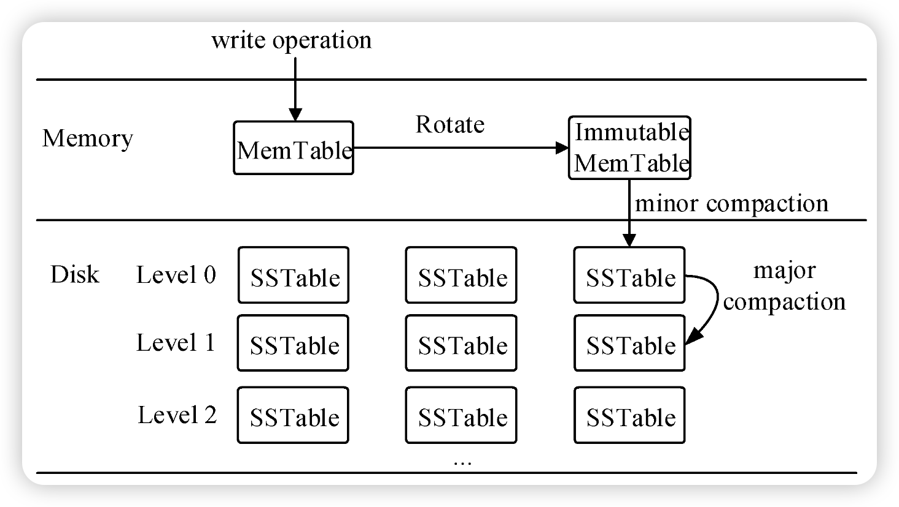

# Compaction

## 概述

Starrocks（SR）最初从Doris分支中独立出来，而Doris的执行引擎一开始是借鉴了Google Mesa，Mesa原本是为了解决广告业务中展示和点击等操作产生的大量数据对存储、实时计算和实时查询等带来的各种难题。

为了提升高频写入能力，Mesa使用了LSM树作为底层存储结构，而高频写入产生的大量小文件又会增加查询时的读IO，导致性能下降，所以为了提升查询性能，LSM树必须在写入之后检查是否需要合并小文件、删除冗余数据、更新数据等操作，并且这个过程是异步的，防止文件合并操作阻塞写入流程。

在LSM树中，通常把文件合并的过程称为**Compaction**，它对LSM树的重要程度如同Rebanlance和Spill之于B+树。这类操作本质上都是为了发挥磁盘连续读写的性能，减少小文件数和IO次数，并能够将随机IO转换成顺序IO。

LSM树分为存储内存数据的**MemTable**和存储磁盘数据的**Sorted String Table（SSTable）**两级存储。

MemTable一般会使用B树（用于Oceanbase）、跳表（用于LevelDB、RocksDB）等内存数据结构来存储，从而保证Key有序；当MemTable满了之后，会通过多路归并排序将数据写入磁盘上的SSTable，因此磁盘上存储的是一个个排好序的文件，并且文件写入后SSTable的数据不再更改。

## 基础的Compaction

LevelDB是LSM树最经典的工程实现，弄懂了LevelDB的Compaction，就能更容易理解Starrocks的Compaction原理，因此，接下来就先分析LevelDB的Compaction实现。

对于这类只有LSM树的物理结构的数据库来说，Compaction的实现相对SR/Doris等数仓产品要简单得多，它分为Immutable MemTable到SSTable的**Minor Compaction**，以及SSTable各层级（LevelDB中最大为7层）之间的**Major Compaction**，即合并压缩第i层SSTable的数据，生成第i+1层的SSTable。Major Compaction按触发条件划分，又可以分成三种：**Size Compaction**，**Seek Compaction**和**Manual Compaction**。



### 触发策略

LevelDB的四种Compaction具有优先级：

Minor Compaction > Manual Compaction > Size Compaction > Seek Compaction

这四种Compaction都通过MaybeScheduleCompaction来判断是否触发，一次Compaction任务触发条件判断的具体流程如下：


接下来，逐个分析图中的四个触发条件：

1. Minor Compaction

   当MemTable大小超过默认的4MB时，先将它转换成**Immutable Memtable**（**此时imm判断为非空**），随后触发MinorCompation。

   Compaction时，LevelDB会遍历Immutable Memtable的Key，写入到Level 0的SSTable中，并在写入之前记录当前版本信息到WAL日志，以便Minor Compation失败后从该WAL恢复。

2. Manual Compaction

   用户主动调用CompactRange触发，**设置manual_compaction_为true**。

   检测给定范围内的Key，先触发Minor Compaction，然后遍历每一层Level，查找给定范围内的Key有文件重叠的SSTable，触发Size Compaction或Seek Compaction。

3. Size Compaction

   根据**compaction_score >= 1**来触发，而compaction_score的计算又有两种方式：

   - **Level 0层**，根据SSTable数（nums）计算compaction_score
   - **非Level 0层**，根据该层SSTable总大小（bytes）计算compaction_score。

   在每次发生了Compaction之后，会更新Version，然后对每层SSTable计算compaction_score，只要满足条件，就触发Size Compaction。简化代码如下：

   ```C++
   void VersionSet::Finalize(Version* v) {
     int best_level = -1;
     double best_score = -1;
     for (int level = 0; level < config::kNumLevels - 1; level++) {
       double score;
       if (level == 0) {
         score = v->files_[level].size() / config::kL0_CompactionTrigger;
       } else {
         score = TotalFileSize(v->files_[level]) / MaxBytesForLevel(level);
       }
       if (score > best_score) {
         best_level = level;
         best_score = score;
       }
     }
     v->compaction_level_ = best_level;
     v->compaction_score_ = best_score;
   }
   ```

4.  Seek Compaction


### 调度方式

任意操作（写入数据/查询）达到任意一个Compaction的触发条件后，就会构造一个Compaction后台任务放到任务队列。

只要队列非空，后台线程就会从中取出Compaction任务执行相应的Compaction逻辑，按照触发方式依次执行CompactMemTable（Minor Compaction）、CompactRange（Manual Compaction）、DoCompactionWork（Major Compaction）。


1. CompactMemTable

2. CompactRange

   Manual Compaction的执行入口，

3. DoCompactionWork

3. RemoveObsoleteFiles


## Starrocks Compaction

SR借助了LSM树的思想，不同的是SR把LSM树的SSTable逻辑上称为**Rowset**，Rowset在物理上又根据**Segment**文件分段，最底层是对旧的Segment文件做Compaction，生成新的Segment文件，而SR里在Rowset之上还需处理Tablet、Partition、Table相关的逻辑，以及管理各层级的元数据和版本信息，因此SR中Compaction的复杂性更多是来自于其逻辑结构。


### 存算一体Compaction实现

#### 触发策略


#### 执行方式

##### 基于事件调度的方式（2.5版本默认开启）


##### 一般调度（2.5版本之前）


#### 数据清理


### 主键表Compaction优化


### 主键索引Compaction


### 存算分离Compaction实现


#### 触发策略


#### 执行方式


# Commit和Publish


