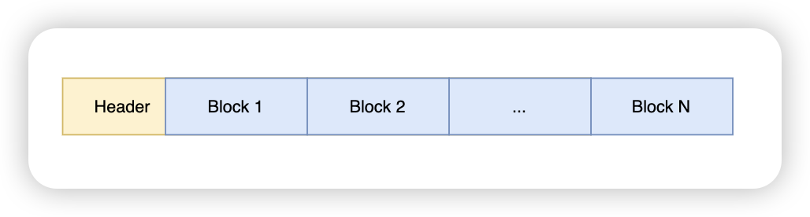
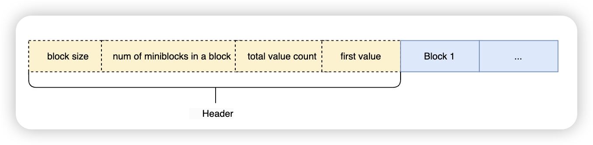
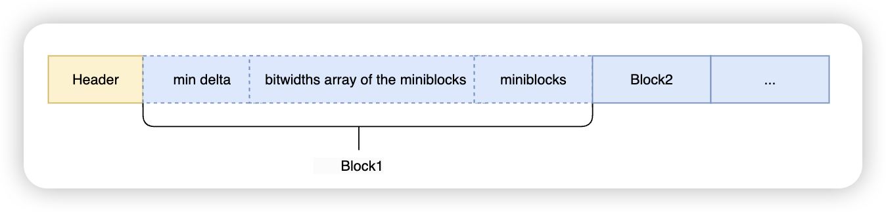

探索数据编码：Delta Encoding

# 写在前面

在解决Doris访问AWS上存储的Parquet文件时，曾碰到过Doris不支持Delta Encoding导致数据读取失败。于是打算整理下跟Delta Encoding相关的知识，为解决连续的整型存储、Timestamp、Date类型存储时的压缩效率问题提供参考。

数据编码指的是从一种数据格式转换成另一种数据格式的过程，用来保证传输时数据格式一致或者一定程度上压缩具备某种规律的数据格式，减少传输开销。而Delta Encoding（翻译为增量编码），对增量数据有很好的压缩作用。


# LEB128

**LEB128**（Little Endian Base 128）是一种变长压缩编码，区别于传统固定字节的int等整数类型，LEB128可将**任意大**的整数存储在少量字节中。

它与可变长量(Variable-length quantity, **VLQ**)格式相似，主要的区别是LEB128是小端数，VLQ是大端数，两者都允许对任意长的数字进行编码。

它的无符号版本是ULEB128，解码时也必须知道编码的值是ULEB128还是LEB128。


## 为什么需要这个编码？

如果我们从字节流中读取一个数字，假如这个数字大于2字节（short类型最大值），小于4字节（int类型最大值），需要花费的存储空间仍然是4个字节。但实际上我们读取的数字在多数情况下，实际占用并没有达到4个字节，比如**1024307**。所以我们需要用LEB128压缩存储空间。

| 类型   | int        | 无符号int  | short | 无符号short |
| ------ | ---------- | ---------- | ----- | ----------- |
| 最大值 | 2147483647 | 4294967295 | 32767 | 65535       |


## 编码过程

LEB128编码时首先需要把一个数的转为二进制格式，然后每7个bit位划分成一组，也就是一个字节只有7个有效位用来存数据，这样最高位就可以用来表示当前字节后续是否还有数据，解码时可用最高位来判断：0代表解码结束，1代表后续还需继续解码。

假设一个数的LEB128编码为`0x05F4`（小端数），两个字节拆分为`0xF4`和`0x05`，读到`0xF4`时发现其二进制最高位是1，代表这个LEB128编码的数据还没读完，读到`0x05`时，最高位是0，就代表这个编码已经解析完，没有要读的数据了。


### ULEB128(Unsigned LEB128)

我们以**1024307**这个数字举例：

```
      大端 ---------------------> 小端    
            1111 1010 0001 0011 0011   --  二进制格式
           01111 1010 0001 0011 0011   --  补0到21位
           0111110  1000010  0110011   --  每7位为1组
          00111110 11000010 10110011   --  每个字节最高位补结束标记，1继续解码，0解码完成
              0x3E     0xC2     0xB3   --  16进制，这个就是VLQ编码结果（大端数）：0x3E C2 B3
                                       --  ULEB128结果为小端数：0xB3 C2 3E
```

1024307的ULEB128编码为`0xB3C23E`，从用Int类型的**4字节存储压缩成3字节存储**。

ULEB128编码：

```
void encode_uleb128(uint32_t value, uint8_t *output, int32_t* output_size) {
    int i = 0;
    while (value != 0) {
        output[i] = value & 0x7F; // 111 1111
        value >>= 7;
        if (value != 0) {
            output[i] |= 0x80; // 1000 0000
        }
        i++;
    }
    *output_size = i;
}
```

ULEB128解码：

```
uint32_t decode_uleb128(const uint8_t *input) {
    uint32_t result = 0;
    int shift = 0;
    for (int i = 0; ; i++) {
        result |= (input[i] & 0x7F) << shift;
        if ((input[i] & 0x80) == 0) {
            return result;
        }
        shift += 7;
    }
}
```

### LEB128

与ULEB128的区别仅在于对负数的处理：

以-666为例：

```
      大端 ---------------------> 小端
                        10 1001 1010   --  二进制格式
                   00 0010 1001 1010   --  补0到14位
                   11 1101 0110 0101   --  负数反码
                   11 1101 0110 0110   --  反码+1（负数补码）
                    1111010  1100110   --  每7位为1组
                   01111010 11100110   --  每个字节最高位补结束标记，1继续解码，0解码完成
                       0x7A     0xE6   --  16进制，VLQ编码结果（大端数）：0x7A E6
                                       --  LEB128结果为小端数：0xE6 7A
```

上面的例子看着似乎没什么问题，但实际上对有符号int的LEB128编码是有问题的。

十六进制-666的有符号int补码表示：0xFFFF FD66，它会把int类型的32位全部占满（并不是上述例子中只占14位），为了凑满7的倍数，补到35位，加上每一个字节高位的结束标记，导致LEB128编码的结果实际上占40位，共5个字节，因此**实际上负数完全没能被压缩**。

Parquet文件格式对有符号数的处理，是使用**ZigZag编码**（也称作之字编码）代替补码运算，把有符号的正负数统一转成无符号数，再使用ULEB128编码，这样就能解决上述问题。


##  ZigZag编码

一种有符号数编码方案，常用于Protocal Buffers中，原理是给正负数交替计数，可以把有符号的正负数映射成无符号数中的正数，可以解决负数压缩效率低的问题。

ZigZag编码很简单，直接通过移位运算实现：zigzag=(n << 1) ^ (n >> k - 1)，k代表位数。比如int类型的k=32。

zigzag函数可以把有符号正数放到无符号数的偶数位，扩展出的奇数位就能用来存负数了。使用异或运算能把负数高位的1置为0。

以32位int类型为例：zigzag=(n << 1) ^ (n >> 31)

| n    | hex         | zigzag(hex) |
| ---- | ----------- | ----------- |
| 0    | 00 00 00 00 | 00 00 00 00 |
| -1   | FF FF FF FF | 00 00 00 01 |
| 1    | 00 00 00 01 | 00 00 00 02 |
| -2   | FF FF FF FE | 00 00 00 03 |
| 2    | 00 00 00 02 | 00 00 00 04 |
| -3   | FF FF FF FD | 00 00 00 05 |
| ...  |             |             |

以上表格可以看出，负数转为正数后，高位都变成0，使用ULEB128就能统一对正负数的高位0进行压缩了。


```
uint32_t zigzag_encode(const int32_t& n) {
    return n << 1 ^ n >> 31;
}

int32_t zigzag_decode(const uint32_t& n) {
    return static_cast<int32_t>(n >> 1 ^ -(n & 1)); // -(n & 1) = ~(n & 1) + 1)
}
```


# Delta Encoding（增量编码）

在Parquet中，一般用于编码int、timestamp、date等可以存在增量的类型，这些类型在Parquet格式里对应的物理类型一般是INT32或INT64。

## 格式

将一组数据编码成一个Header和多个Block的变长数组：



其中，每个Block又是由多个mini block组成。


### Header

一个delta 编码的header需要记录每个block大小、每个block由多少个miniblock组成、存多少个值、第一个数的值。



- 只有the first value（有符号数）使用ZigZag + ULEB128编码，其他三个属性（无符号数）使用 ULEB128编码
- **block size**是128的倍数，一个block不一定存满，因此读取完每个block需要跳过末尾的padding，保证block对齐。
- **mini block的大小**（block size / num of miniblocks per block）必须是32的倍数，假设block size=128，num of miniblocks=4，那么每个miniblocks大小就是128/4 = 32 bit。


### Block



- min delta（有符号数）使用ZigZag ULEB128编码
- miniblock用来存一组数据的增量，每个mini block的位宽用1字节存储，获取位宽时不足一字节需要对齐。
- 每个miniblock都是根据它存放在bitwidths的位宽构造成的位序列(bit packed)，这里的bitwidths数组可以理解为将miniblock进一步按不同的位宽去划分每一个增量需要的位数。

接着Header中计算miniblock大小的例子：

- block size=128，4个miniblock，每个miniblock占32位
- bitwidths数组中存4个位宽：2、4、8、2
- 每个miniblock存的增量值的个数：16（32/2）、8（32/4）、4（32/8）、16
  - 在miniblock 1中，位宽为2，相当于存16个short的增量值
  - 在miniblock 2中，位宽为4，相当于存8个int型的增量值
- miniblocks存放每个完成打包的miniblock。

## 示例

官方的例子假设了block size = 8（实际使用一定是128的倍数）用于演示：


### Example 1

7, 5, 3, 1, 2, 3, 4, 5, the deltas would be

-2, -2, -2, 1, 1, 1, 1

The minimum is -2, so the relative deltas are:

0, 0, 0, 3, 3, 3, 3

The encoded data is

header: 8 (block size), 1 (miniblock count), 8 (value count), 7 (first value)

block: -2 (minimum delta), 2 (bitwidth), 00000011111111b (0,0,0,3,3,3,3 packed on 2 bits)


在展示的block中，3的二进制表示11，位宽为2，组成mini block：00 00 00 11 11 11 11，每2个比特位用于存储delta数值，压缩了整型的存储空间。


> 官方例子里，只有一个位宽为2的miniblock，我们可以假设，后续增量在4-7之间（100-111），位宽为3，那么第二个位宽为3的miniblock里，可以存4、5、6、7这四个增量的值。


在一个block中，根据first value, min delta, delta（根据位宽解码mini block得到）就能够确定存储的数据：

```
7 (first value)
7 +(-2) + (0) = 5
5 +(-2) + (0) = 3
3 +(-2) + (0) = 1
1 +(-2) + (3) = 2
2 +(-2) + (3) = 3
3 +(-2) + (3) = 4
4 +(-2) + (3) = 5
```

该例子中，数值都比较小，对于timestamp这类大数值类型来说，只存增量让它的压缩效率非常高。

与RLE/bit packing编码相比，delta encoding每个mini block的位宽可以是不同的，而RLE在整个Page使用统一的位宽。

另外，如果一个block里头的delta增量都是相同值，位宽就是0，只作为标头：


### Example 2

1, 2, 3, 4, 5

After step 1), we compute the deltas as:

1, 1, 1, 1

The minimum delta is 1 and after step 2, the relative deltas become:

0, 0, 0, 0

The final encoded data is:

header: 8 (block size), 1 (miniblock count), 5 (value count), 1 (first value)

block: 1 (minimum delta), 0 (bitwidth), (no data needed for bitwidth 0)


从以上示例，可以得到delta编码的步骤：

- 生成Header
  - 根据数据量，选择合适的block size和每个block的miniblock数目，ULEB128编码后写入Header
  - 总的元素值的个数ULEB128编码后写入Header
  - 第一个值，ZigZag + ULEB128编码后写入Header
- 写入Block
  - 计算各元素间的差值，作为增量delta，找到最小增量**min delta**，ZigZag + ULEB128编码后写入Block。
  - 使用min delta作为参照，计算block中所有delta增量减去min delta的值，得到miniblock的每一个delta。
  - 根据block size/miniblock数目，以及delta的大小，划分miniblock，计算位宽数组**bitwidths**，直接写入Block。
  - 每个minblock的delta根据位宽打包，组成**minblocks**，直接写入Block
  - 写满当前Block，继续写下一个Block，重新计算delta。

特例就是delta增量都是相同值时，block里只有min delta，除了header和min delta，不会有额外的存储空间，这对连续的timestamp类型来说，大大提高了压缩效率。


# 参考

1. Parquet Encoding

https://parquet.apache.org/docs/file-format/data-pages/encodings/

2. Doris中的Bit编码

BitReader::GetVlqInt 用来解码ULEB128

BitReader::GetZigZagVlqInt(int32_t* v)，将无符号数通过“之字编码” 解码成有符号数

3. 在Doris中的应用

 https://github.com/apache/doris/blob/master/be/src/vec/exec/format/parquet/delta_bit_pack_decoder.h 

