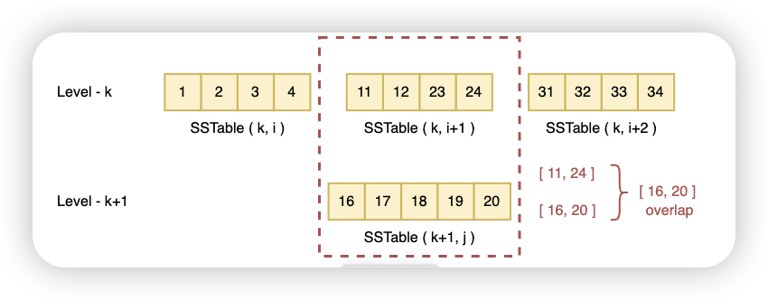
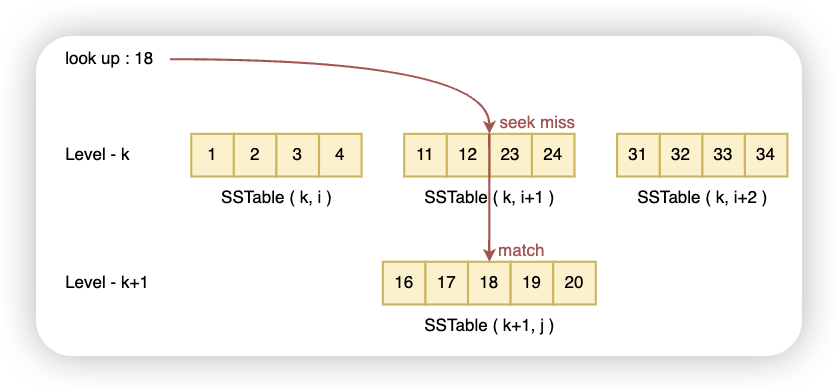
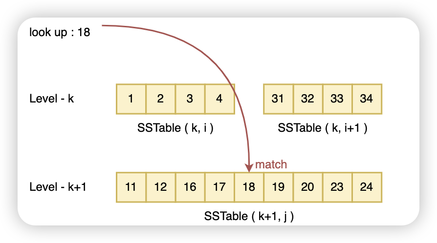
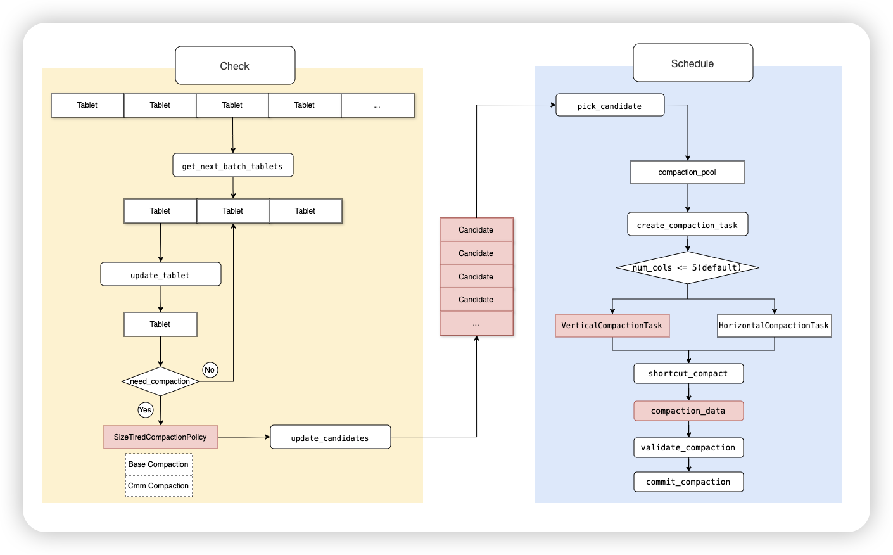

# Compaction

## 概述

Starrocks（SR）最初从Doris分支中独立出来，而Doris的执行引擎一开始是借鉴了Google Mesa，Mesa原本是为了解决广告业务中展示和点击等操作产生的大量数据对存储、实时计算和实时查询等带来的各种难题。

为了提升高频写入能力，Mesa使用了LSM树作为底层存储结构，而高频写入产生的大量小文件又会增加查询时的读IO，导致性能下降，所以为了提升查询性能，LSM树必须在写入之后检查是否需要合并小文件、删除冗余数据、更新数据等操作，并且这个过程是异步的，防止文件合并操作阻塞写入流程。

在LSM树中，通常把文件合并的过程称为**Compaction**，它对LSM树的重要程度如同Rebanlance和Spill之于B+树。这类操作本质上都是为了发挥磁盘连续读写的性能，减少小文件数和IO次数，并能够将随机IO转换成顺序IO。

LSM树分为存储内存数据的**MemTable**和存储磁盘数据的**Sorted String Table（SSTable）**两级存储。

MemTable一般会使用B树（用于Oceanbase）、跳表（用于LevelDB、RocksDB）等内存数据结构来存储，从而保证Key有序；当MemTable满了之后，会通过多路归并排序将数据写入磁盘上的SSTable，因此磁盘上存储的是一个个排好序的文件，并且文件写入后SSTable的数据不再更改。

## 基础的Compaction

LevelDB是LSM树最经典的工程实现，弄懂了LevelDB的Compaction，就能更容易理解Starrocks的Compaction原理，因此，接下来就先分析LevelDB的Compaction实现。

对于这类只有LSM树的物理结构的数据库来说，Compaction的实现相对SR/Doris等数仓产品要简单得多，它分为Immutable MemTable到SSTable的**Minor Compaction**，以及SSTable各层级（LevelDB中最大为7层）之间的**Major Compaction**，即合并压缩第i层SSTable的数据，生成第i+1层的SSTable。Major Compaction按触发条件划分，又可以分成三种：**Size Compaction**，**Seek Compaction**和**Manual Compaction**。


### 触发策略

LevelDB的四种Compaction具有优先级：

Minor Compaction > Manual Compaction > Size Compaction > Seek Compaction

这四种Compaction都通过MaybeScheduleCompaction来判断是否触发，一次Compaction任务触发条件判断的具体流程如下：


接下来，逐个分析图中的四个触发条件：

1. Minor Compaction

   当MemTable大小超过默认的4MB时，先将它转换成**Immutable Memtable**（**此时imm判断为非空**），随后触发MinorCompation。

   Compaction时，LevelDB会遍历Immutable Memtable的Key，写入到Level 0的SSTable中，并在写入之前记录当前版本信息到WAL日志，以便Minor Compation失败后从该WAL恢复。

2. Manual Compaction

   用户主动调用CompactRange触发，**设置manual_compaction_为true**。

   检测给定范围内的Key，先触发Minor Compaction，然后遍历每一层Level，查找给定范围内的Key有文件重叠的SSTable，触发Size Compaction或Seek Compaction。

3. Size Compaction

   根据**compaction_score >= 1**来触发，而compaction_score的计算又有两种方式：

   - **Level 0层**，根据SSTable数（nums）计算compaction_score
   - **非Level 0层**，根据该层SSTable总大小（bytes）计算compaction_score。

   在每次发生了Compaction之后，会更新Version，然后对每层SSTable计算compaction_score，只要满足条件，就触发Size Compaction。简化代码如下：

   ```C++
   void VersionSet::Finalize(Version* v) {
     int best_level = -1;
     double best_score = -1;
     for (int level = 0; level < config::kNumLevels - 1; level++) {
       double score;
       if (level == 0) {
         score = v->files_[level].size() / config::kL0_CompactionTrigger;
       } else {
         score = TotalFileSize(v->files_[level]) / MaxBytesForLevel(level);
       }
       if (score > best_score) {
         best_level = level;
         best_score = score;
       }
     }
     v->compaction_level_ = best_level;
     v->compaction_score_ = best_score;
   }
   ```

4. Seek Compaction

   除了Level 0层之外，在同一个Level的SSTable之间不会有**overlap**（重叠的key范围），但是在不同Level之间还是可能存在overlap：

   

当要查找的Key在Level k层没有命中，就会继续往下一层查找：



增加`allowed_seeks`字段，该字段初始为文件大小与16KB的比值，每次触发seek miss就会减少allowed_seeks次数，直到0时触发seek compaction。




### 调度方式

任意操作（写入数据/查询）达到任意一个Compaction的触发条件后，就会构造一个Compaction后台任务放到任务队列。

只要队列非空，后台线程就会从中取出Compaction任务执行相应的Compaction逻辑，按照触发方式依次执行CompactMemTable（Minor Compaction）、CompactRange（Manual Compaction）、DoCompactionWork（Major Compaction）。

#### Minor Compaction: CompactMemTable

CompactMemTable把Immutable MemTable写到SSTable文件，此时如果下一个MemTable未写满，那么就可以继续写入MemTable，但在下一个MemTable写满之后，如果上一个Immutable MemTable的Minor Compaction没有做完，此时LevelDB会停止写入，防止Immutable MemTable写入文件之前再继续生成新的Immutable MemTable（内存中只能存在一个Immutable MemTable）。

Thread 1:  Write Ahead Log1 >  MemTable -> （） Immutable MemTable -> Write Ahead Log2

Thread 2:  Immutable MemTable -> CompactMemTable -> Level N -> Delete Imm and Minor Compaction完成之后删除旧的WAL日志，在删除WAL之前，Compaction失败都能从WAL日志恢复。

显然，LevelDB的Minor Compaction因只支持单线程的Compaction，写入负载较高的情况下，性能较差，当前的LSM树结构（从RocksDB开始）的引擎都支持并发的Compaction了。

Level 0层，SSTable之间的overlap较多，Level 0到Level 1层的Major Compaction开销也就更大，为了减少Level 0 层的Major Compaction，LevelDB会在Minor Compaction时，尽可能把Immutable MemTable生成的文件推到更下层的Level，即Minor Compaction的输入是Immutable MemTable，输出是

#### Manual Compaction: CompactRange

Manual Compaction的执行入口


#### Major Compaction: DoCompactionWork

为了避免在上层Level发生过多的Seek Miss影响性能，Major Compaction（触发Seek Compaction）会先往下查找合适的Level（没有跟上层有过多overlap的SSTable），这样可以直接将 Immutable MemTable写入更底层的Level，查询时减少Seek的层数。


#### 数据清理

​	RemoveObsoleteFiles清除旧的文件


## Starrocks Compaction

SR借助了LSM树的思想，不同的是SR把LSM树的SSTable逻辑上称为**Rowset**，Rowset在物理上又根据**Segment**文件分段，最底层是对旧的Segment文件做Compaction，生成新的Segment文件，而SR里在Rowset之上还需处理Tablet、Partition、Table相关的逻辑，以及管理各层级的元数据和版本信息，因此SR中Compaction的复杂性更多是来自于其逻辑结构。

SR的Minor compaction是每次写满一个immtable memtable，就flush到磁盘，一个immtable memtable写到一个segment文件，多个segment文件组成一个rowset。并且一次写入事务只生成一个版本的rowset。

SR在Rowset的Major Compaction类似LevelDB的Size Compaction，对Rowset计算Compaction Score，不同于leveldb每次选择一个level的SSTable做compaction的方式，而SR会根据RowSet的Score排序，每次合并指定数目的Rowset，并且支持多线程做compaction。


### 存算一体Compaction实现

Starrocks的Major Compaction根据阶段又能划分为Base Compaction和Cumulative Compaction。在2.5版本之后，为了减少闲置线程，采用的执行方式为基于候选队列的Compaction模型，对于这两种Compaction我们只研究这一方式的实现。

对于主键表，Starrocks对其做的增量Compaction称为Update Compaction，它依然使用旧的实现方式。

#### 执行方式

主要分为以下几步：

检查线程：

1. 定时从BE上的tablet中，根据batch size挑选出一批tablets
2. 遍历当前批次的tablet，根据不同的策略，判断是否满足compaction条件，默认策略为SizeTiredCompaction
3. 判断Compaction类型是Base Compaction还是Cumulative Compaction，计算Compaction Score，放入候选队列

调度线程：

1. 从候选队列中选择Compaction Score最高的candidate，构造Compaction Task放入Compaction Pool
2. 构造构造Compaction Task时，根据当前的Tablet中需要Compaction的列数选择Compaction任务类型
   1. 大于5列，按列Compaction，创建**Vertical Compaction Task**
   2. 小于等于5列，创建**Horizontal Compaction Task**
3. 执行Compaction任务
   1. 只有一个Rowset的情况，根据判断条件，执行shortcut_compact
   2. 执行compaction_data
   3. 检查Compaction结果行数
   4. 提交Compaction，更改元数据，无用的Rowset放入清除队列，交给异步线程清除




#### 触发策略

触发compaction的逻辑封装在Tablet的**need_compation**里，为了选取出需要做compaction的tablet，Starrocks采用分批遍历tablet的方式，检查是否有tablet满足compaction的条件，如果满足条件（有rowset需要compact），就把该tablet放到候选队列中。具体对tablet是否满足条件的判断策略有两个：

- 根据segment文件数选择合适的rowset合并的默认策略，默认选取segment文件数超过1000个的rowset出来，这个策略会导致Cumulative Compaction任务执行时间长，占用资源多。
- 基于rowset大小、segment文件数综合考虑的SizeTired策略，即2.5版本后默认的SizeTiredCompactionPolicy。

##### SizeTiredCompactionPolicy

核心思想是对大小相近的Rowset分层，将同层Rowset合并到下一层，可以避免大的Rowset频繁合并，尽量合并小的Rowset，减少资源占用和Compaction耗时。

1. Rowset的选取

该策略会把Rowsets按大小分为默认的7层（**size_tiered_level_num**），相邻两层之间大小默认差5倍（**size_tiered_level_multiple**），**size_tiered_min_level_size**可以配置第一层level存放的Rowset大小，默认的7个level大小依次是128K、640K、3M、15M、78M、390M、1.9G。level越高，数据越大，耗费时间更长，compaction的优先级就越低。

在选择合适的rowsets时，SizeTiredCompactionPolicy会分配每一个的Rowset到所在的level，并计算该Rowset的score。然后用同一level的rowsets，构造SizeTieredLevel对象放入优先队列，最后从优先队列中选择segment数大于指定配置（**min_cumulative_compaction_num_singleton_deltas**）的SizeTieredLevel，使用存在它里头的rowsets去做compaction。

2. Base Compaction

   从优先队列选择出来的Rowsets（rowset遍历时版本有序），SizeTiredCompactionPolicy会根据这批Rowsets中的第一个Rowset的start_version判断是否此次compaction是Base Compaction，否则就是Cumulative Compaction。

   另外，在SizeTiredCompactionPolicy对rowsets的选取过程中第一个候选的Rowset创建时间大于Base Compaction的触发间隔，也会直接升级为Base Compaction。
   
   

##### Compaction Score

影响Size-tired策略计算Compaction Score的因素一共有5个：表类型、rowset大小、segment文件数、rowset level、rowset数，

1. 表类型、rowset大小、segment文件数对score计算的影响

对于明细表，因为查询时没有额外的计算，只存在写放大，计算score时只需考虑每一层的rowset大小，因此它的rowset越大，compaction score越大。

聚合表和unique表内部存在计算逻辑，在segment数较多的情况下，有读放大，compaction后会减少segment数，提高读性能，因此segment数量会纳入计算因子，并且占计算score时的权重更大。

2. rowset level对score计算的影响

   根据SizeTiredCompactionPolicy的定义，level越低，compaction需要的数据量越小，处理起来会更快，因此会给予更大的score。

3. rowset数对score计算的影响

   tablet达到最大版本数，会导致无法写入数据，因此在候选的rowset数目达到tablet版本的90%时，会让该层的rowset score翻倍，以便更快合并rowset。


#### 合并rowset

Schedule线程会定期从候选队列中获取需要做compaction的tablet，创建CompactionTask，合并该tablet里的rowsets。

获取tablet时，需要检查tablet当前运行状态、获取状态锁、检查Cumulative/Base Compaction每个磁盘的线程数控制并发和失败重试间隔。

Base Compaction和Cumulative Compaction的执行过程一致，区别在于Base Compaction才会删除数据。


Shortcut Compaction。这个过程是一种快捷Compaction的方式，即无需磁盘IO即可完成Compaction。需要以下前提条件，第一个条件就是此次任务只有一个rowset参与，第二个条件是rowset中segment文件数量至少两个，且文件之间没有数据重叠，第三个条件是rowset没有被Compaction过，第四个条件是执行方式是行式。它的原理是使用文件系统的硬链接能力。

Data Compaction。将挑选出rowsets进行合并，生成一个output rowset。在执行rowsets合并时，会创建一个Reader和一个rowset writer，rowset writer与output rowset相对应。在Reader底层逻辑中，input rowsets中的每一个rowset都会对应一个rowset reader。Reader按照key的排序规则逐行读出input rowsets中的数据，然后通过Rowset Writer写入output rowset。Cumulative Compaction不会将删除的数据行进行真正地删除，这部分工作会在Base Compaction中进行。

Valid Compaction。这部分所做的工作就比较简单了，校验下Compaction输入行数和输出行数、合并行数、过滤行数总和是否相同。

Commit Compaction。这部分工作就是修改下Tablet关于rowset的元数据部分，包括删除旧的版本和添加新版本、close掉输入的rowset和加载rowset。


#### 数据清理


### 主键表Compaction


### 主键索引Compaction


# Commit和Publish


