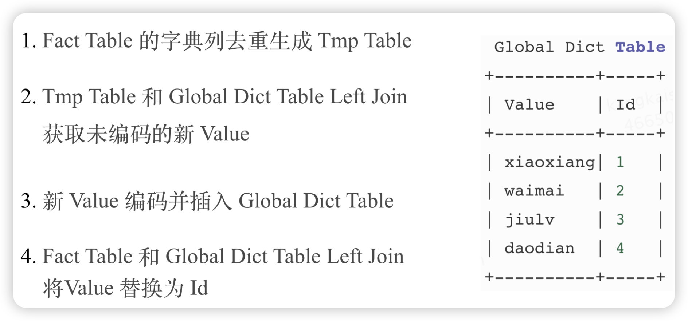

论文：https://arxiv.org/pdf/1402.6407

官方库：https://github.com/RoaringBitmap，提供了多语言Roaring Bitmap实现，有实力的为了提升性能也可以针对性改写相关类库

CRoaring Bitmap: https://github.com/RoaringBitmap/CRoaring

对比Java库和C库的性能，探索SIMD有多大的优化

## Roaring Bitmap 基本原理

Roaring Bitmap 的核心思路很简单，**就是根据数据的不同特征采用不同的存储或压缩方式。** 为了实现这一点，Roaring Bitmap 首先进行了分桶，将整个 int 域拆成了 2 的 16 次方 65536 个桶，每个桶最多包含 65536 个元素。 所以一个 int 的高 16 位决定了，它位于哪个桶，桶里只存储低 16 位。以图中的例子来说，62 的前 1000 个倍数，高 16 位都是 0，所以都在第一个桶里。

然后在桶粒度针对不同的数据特点，采用不同的存储或压缩方式：

默认会采用 16 位的 Short 数组来存储低 16 位数据，当元素个数超过 4096 时，会采用 Bitmap 来存储数据。 为什么是 4096 呢？ 我们知道， 如果用 Bitmap 来存，65526 个 bit, 除以 8 是 8192 个字节，而 4096 个 Short 就是 4096 * 2 = 8192 个字节。 所以当元素个数少于 4096 时，Array 存储效率高，当大于 4096 时，Bitmap 存储效率高。

第 3 类 Run Container 是优化连续的数据， Run 指的是 Run Length Encoding（RLE），比如我们有 10 到 1000 折连续的 991 个数字，那么其实不需要连续存储 10 到 1000，这 991 个整形，我们只需要存储 1 和 990 这两个整形就够了。

## Roaring Bitmap使用

### 基于Trie的全局字典

Roaring Bitmap只存储整型，所以还需解决任意类型到整型数据的映射。可以使用全局字典比如Trie树。

Trie 树的问题是字典对应的编码值是基于节点位置决定的，所以 Trie 树是不可变的。 这样没办法用来实现全局字典，因为要做全局字典必然要支持追加。

要实现全局字典，Trie 树必然要支持**可追加**，在可追加的情况下，我们需要解决如何让同一个 String 永远映射到同一个 ID。一个简单的思路是我们把 String 对应的 ID 直接序列化下来，因为全局字典只需要支持 String 到 ID 的单向查找，不需要支持 ID 到 String 的反向查找。

当全局字典越来越大的时候，就会面临内存不足的问题。一个自然的想法就是 Split, 如图所示。当全局字典拆成多个子树之后，必然会涉及到每个子树的按需加载和删除，这个功能是使用 Guava 的 LoadingCache 实现的。

为了解决读写冲突的问题，我们实现了 MVCC，使得读写可以同时进行。

读的时候永远读取最新 Version 的数据，写的时候会先写到临时目录，完成后再拷贝到最新的 Version 目录。 同时为了保证全局字典的并发更新，我们引入了分布式锁。

全局字典的编码过程是串行的，没有分布式化，所以当全局字典的基数到几十亿规模时，编码过程就会很慢。 一个可行的思路是，类似 Roaring Bitmap，我们可以将整个 Int 域进行分桶，每个桶对应固定范围的 ID 编码值，每个 String 通过 Hash 决定它会落到哪个桶内，这样全局字典的编码过程就可以并发。

### 基于Hive的全局字典

解决基于 Trie 树的全局字典无法分布式构建的问题。

这种方案中全局字典本身是一张 Hive 表，Hive 表有两个列，一个是原始值，一个是编码的 Int 值，然后通过上面的 4 步就可以通过 Spark 或者 MR 实现全局字典的更新，和对事实表中 Value 列的替换。

基于 Hive 表的全局字典相比基于 Trie 树的全局字典的优点除了可以分布式化，还可以实现全局字典的复用。 但是缺点也是显而易见，相比基于 Trie 树的全局字典，会使用多几倍的资源，因为原始事实表会被读取多次，而且还有两次 Join。

